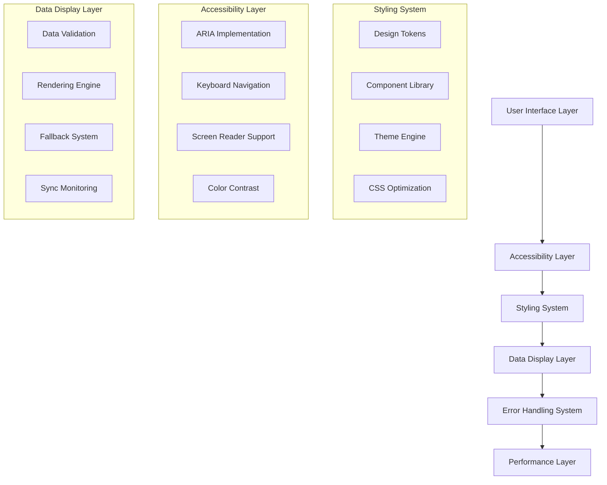

# Styling, Accessibility & Data Display Optimization Design

## Overview

This design document outlines a comprehensive optimization strategy for the Wedflow platform to address critical styling inconsistencies, accessibility violations, and data display issues. The solution focuses on creating a robust, maintainable, and accessible user experience while ensuring data integrity between the dashboard and public wedding sites.

## Architecture

### High-Level Optimization Architecture



### Component Optimization Strategy

The optimization will follow a systematic approach:

1. **Foundation Layer**: Design tokens, accessibility primitives, and core utilities
2. **Component Layer**: Optimized, accessible UI components with consistent styling
3. **Layout Layer**: Responsive layouts with proper semantic structure
4. **Data Layer**: Robust data fetching, validation, and display logic
5. **Performance Layer**: Optimization for loading, rendering, and user experience

## Components and Interfaces

### 1. Design Token System

```typescript
interface DesignTokens {
  colors: {
    primary: ColorScale;
    secondary: ColorScale;
    accent: ColorScale;
    neutral: ColorScale;
    semantic: SemanticColors;
  };
  typography: {
    fontFamilies: FontFamilyTokens;
    fontSizes: FontSizeScale;
    fontWeights: FontWeightScale;
    lineHeights: LineHeightScale;
  };
  spacing: SpacingScale;
  shadows: ShadowScale;
  borderRadius: BorderRadiusScale;
  breakpoints: BreakpointTokens;
}

interface ColorScale {
  50: string;
  100: string;
  200: string;
  300: string;
  400: string;
  500: string; // Base color
  600: string;
  700: string;
  800: string;
  900: string;
  950: string;
}

interface SemanticColors {
  success: ColorScale;
  warning: ColorScale;
  error: ColorScale;
  info: ColorScale;
}
```

### 2. Accessibility System

```typescript
interface AccessibilityProvider {
  announceToScreenReader(message: string): void;
  manageFocus(element: HTMLElement): void;
  validateColorContrast(foreground: string, background: string): boolean;
  generateAriaLabel(context: AriaContext): string;
  handleKeyboardNavigation(event: KeyboardEvent): void;
}

interface AriaContext {
  componentType: string;
  state?: string;
  position?: { current: number; total: number };
  description?: string;
}

interface AccessibilityConfig {
  announcements: boolean;
  reducedMotion: boolean;
  highContrast: boolean;
  focusVisible: boolean;
  screenReaderOptimizations: boolean;
}
```

### 3. Enhanced Theme Engine

```typescript
interface ThemeEngine {
  applyTheme(themeId: string): Promise<void>;
  validateTheme(theme: Theme): ValidationResult;
  generateCSS(theme: Theme): string;
  previewTheme(theme: Theme): ThemePreview;
  resetToDefault(): void;
}

interface Theme {
  id: string;
  name: string;
  colors: ThemeColors;
  typography: ThemeTypography;
  layout: ThemeLayout;
  animations: ThemeAnimations;
  accessibility: AccessibilityOverrides;
}

interface ThemeColors {
  primary: string;
  secondary: string;
  accent: string;
  background: string;
  surface: string;
  text: {
    primary: string;
    secondary: string;
    disabled: string;
  };
}
```

### 4. Data Display System

```typescript
interface DataDisplayManager {
  validateData<T>(data: T, schema: ValidationSchema): ValidationResult;
  renderWithFallback<T>(
    data: T | null,
    fallback: React.ComponentType
  ): React.ReactElement;
  syncData(source: DataSource, target: DataTarget): Promise<SyncResult>;
  monitorDataIntegrity(): void;
}

interface ValidationResult {
  isValid: boolean;
  errors: ValidationError[];
  warnings: ValidationWarning[];
}

interface SyncResult {
  success: boolean;
  syncedFields: string[];
  failedFields: FieldError[];
  timestamp: Date;
}

interface DataSyncMonitor {
  checkSyncStatus(coupleId: string): Promise<SyncStatus>;
  forceSyncData(coupleId: string): Promise<SyncResult>;
  subscribeSyncUpdates(callback: (status: SyncStatus) => void): () => void;
}
```

### 5. Error Handling System

```typescript
interface ErrorBoundarySystem {
  captureError(error: Error, errorInfo: ErrorInfo): void;
  displayFallbackUI(error: Error): React.ReactElement;
  reportError(error: Error, context: ErrorContext): void;
  recoverFromError(): void;
}

interface ErrorContext {
  component: string;
  action: string;
  userId?: string;
  timestamp: Date;
  userAgent: string;
  url: string;
}

interface UserFeedbackSystem {
  showSuccess(message: string, duration?: number): void;
  showError(message: string, action?: ErrorAction): void;
  showLoading(message: string): LoadingHandle;
  showWarning(message: string): void;
}
```

## Data Models

### Enhanced Component Props

```typescript
interface AccessibleComponentProps {
  "aria-label"?: string;
  "aria-labelledby"?: string;
  "aria-describedby"?: string;
  "aria-expanded"?: boolean;
  "aria-selected"?: boolean;
  "aria-disabled"?: boolean;
  role?: string;
  tabIndex?: number;
  onKeyDown?: (event: KeyboardEvent) => void;
}

interface ResponsiveImageProps {
  src: string;
  alt: string;
  sizes: string;
  srcSet?: string;
  loading?: "lazy" | "eager";
  priority?: boolean;
  placeholder?: "blur" | "empty";
  blurDataURL?: string;
  onLoad?: () => void;
  onError?: () => void;
}
```

### Data Validation Schemas

```typescript
interface EventDataSchema {
  name: { required: true; minLength: 1; maxLength: 100 };
  date: { required: true; format: "date" };
  time: { required: true; format: "time" };
  description: { required: false; maxLength: 500 };
  venue?: VenueDataSchema;
}

interface PhotoDataSchema {
  id: { required: true; format: "uuid" };
  name: { required: true; minLength: 1 };
  public_url: { required: true; format: "url" };
  thumbnail_url: { required: false; format: "url" };
  category: { required: true; enum: PhotoCategories };
}

interface GiftDataSchema {
  upi_id: { required: false; format: "upi" };
  qr_code_url: { required: false; format: "url" };
  custom_message: { required: false; maxLength: 200 };
}
```

## Styling System Design

### 1. CSS Architecture

```css
/* Design Tokens */
:root {
  /* Color System */
  --color-primary-50: #fef7ff;
  --color-primary-500: #a855f7;
  --color-primary-900: #581c87;

  /* Typography System */
  --font-family-heading: "Playfair Display", serif;
  --font-family-body: "Inter", sans-serif;
  --font-size-xs: 0.75rem;
  --font-size-base: 1rem;
  --font-size-xl: 1.25rem;

  /* Spacing System */
  --spacing-1: 0.25rem;
  --spacing-4: 1rem;
  --spacing-8: 2rem;

  /* Shadow System */
  --shadow-sm: 0 1px 2px 0 rgb(0 0 0 / 0.05);
  --shadow-lg: 0 10px 15px -3px rgb(0 0 0 / 0.1);

  /* Border Radius */
  --radius-sm: 0.375rem;
  --radius-lg: 0.75rem;
  --radius-xl: 1rem;
}

/* Accessibility Utilities */
.sr-only {
  position: absolute;
  width: 1px;
  height: 1px;
  padding: 0;
  margin: -1px;
  overflow: hidden;
  clip: rect(0, 0, 0, 0);
  white-space: nowrap;
  border: 0;
}

.focus-visible {
  outline: 2px solid var(--color-primary-500);
  outline-offset: 2px;
}

/* Motion Preferences */
@media (prefers-reduced-motion: reduce) {
  *,
  *::before,
  *::after {
    animation-duration: 0.01ms !important;
    animation-iteration-count: 1 !important;
    transition-duration: 0.01ms !important;
    scroll-behavior: auto !important;
  }
}
```

### 2. Component Styling Standards

```typescript
// Styled component with accessibility and responsive design
const StyledButton = styled.button<ButtonProps>`
  /* Base styles */
  display: inline-flex;
  align-items: center;
  justify-content: center;
  gap: var(--spacing-2);
  padding: var(--spacing-3) var(--spacing-6);
  border-radius: var(--radius-lg);
  font-family: var(--font-family-body);
  font-weight: 500;
  transition: all 0.2s ease-in-out;

  /* Accessibility */
  min-height: 44px; /* Touch target size */
  cursor: pointer;

  &:focus-visible {
    outline: 2px solid var(--color-primary-500);
    outline-offset: 2px;
  }

  &:disabled {
    opacity: 0.5;
    cursor: not-allowed;
  }

  /* Variants */
  ${({ variant }) =>
    variant === "primary" &&
    css`
      background-color: var(--color-primary-500);
      color: white;

      &:hover:not(:disabled) {
        background-color: var(--color-primary-600);
      }
    `}

  /* Responsive design */
  @media (max-width: 768px) {
    padding: var(--spacing-4) var(--spacing-8);
    font-size: var(--font-size-base);
  }
`;
```

## Error Handling Design

### 1. Error Boundary Implementation

```typescript
class PublicSiteErrorBoundary extends React.Component<
  ErrorBoundaryProps,
  ErrorBoundaryState
> {
  constructor(props: ErrorBoundaryProps) {
    super(props);
    this.state = { hasError: false, error: null };
  }

  static getDerivedStateFromError(error: Error): ErrorBoundaryState {
    return { hasError: true, error };
  }

  componentDidCatch(error: Error, errorInfo: ErrorInfo) {
    // Log error to monitoring service
    this.props.onError?.(error, errorInfo);

    // Report to error tracking
    reportError(error, {
      component: "PublicSiteErrorBoundary",
      errorInfo,
      timestamp: new Date(),
    });
  }

  render() {
    if (this.state.hasError) {
      return (
        <ErrorFallback
          error={this.state.error}
          onRetry={() => this.setState({ hasError: false, error: null })}
        />
      );
    }

    return this.props.children;
  }
}
```

### 2. Data Loading States

```typescript
interface DataLoadingState<T> {
  data: T | null;
  loading: boolean;
  error: Error | null;
  retry: () => void;
}

function useWeddingData(slug: string): DataLoadingState<WeddingData> {
  const [state, setState] = useState<DataLoadingState<WeddingData>>({
    data: null,
    loading: true,
    error: null,
    retry: () => {},
  });

  const fetchData = useCallback(async () => {
    setState((prev) => ({ ...prev, loading: true, error: null }));

    try {
      const response = await fetch(`/api/public/${slug}`);

      if (!response.ok) {
        throw new Error(`Failed to fetch wedding data: ${response.status}`);
      }

      const data = await response.json();
      const validationResult = validateWeddingData(data);

      if (!validationResult.isValid) {
        throw new Error("Invalid wedding data received");
      }

      setState((prev) => ({ ...prev, data, loading: false }));
    } catch (error) {
      setState((prev) => ({
        ...prev,
        error: error as Error,
        loading: false,
      }));
    }
  }, [slug]);

  useEffect(() => {
    fetchData();
  }, [fetchData]);

  return { ...state, retry: fetchData };
}
```

## Accessibility Implementation

### 1. ARIA Implementation

```typescript
interface AriaLiveRegion {
  announce(message: string, priority?: "polite" | "assertive"): void;
  clear(): void;
}

const useAriaLiveRegion = (): AriaLiveRegion => {
  const politeRef = useRef<HTMLDivElement>(null);
  const assertiveRef = useRef<HTMLDivElement>(null);

  const announce = useCallback(
    (message: string, priority: "polite" | "assertive" = "polite") => {
      const element =
        priority === "polite" ? politeRef.current : assertiveRef.current;
      if (element) {
        element.textContent = message;
        // Clear after announcement
        setTimeout(() => {
          element.textContent = "";
        }, 1000);
      }
    },
    []
  );

  const clear = useCallback(() => {
    if (politeRef.current) politeRef.current.textContent = "";
    if (assertiveRef.current) assertiveRef.current.textContent = "";
  }, []);

  return { announce, clear };
};
```

### 2. Keyboard Navigation

```typescript
const useKeyboardNavigation = (items: NavigationItem[]) => {
  const [focusedIndex, setFocusedIndex] = useState(0);
  const itemRefs = useRef<(HTMLElement | null)[]>([]);

  const handleKeyDown = useCallback(
    (event: KeyboardEvent) => {
      switch (event.key) {
        case "ArrowDown":
          event.preventDefault();
          setFocusedIndex((prev) => (prev + 1) % items.length);
          break;
        case "ArrowUp":
          event.preventDefault();
          setFocusedIndex((prev) => (prev - 1 + items.length) % items.length);
          break;
        case "Home":
          event.preventDefault();
          setFocusedIndex(0);
          break;
        case "End":
          event.preventDefault();
          setFocusedIndex(items.length - 1);
          break;
        case "Enter":
        case " ":
          event.preventDefault();
          items[focusedIndex]?.onSelect?.();
          break;
      }
    },
    [items, focusedIndex]
  );

  useEffect(() => {
    itemRefs.current[focusedIndex]?.focus();
  }, [focusedIndex]);

  return { focusedIndex, handleKeyDown, itemRefs };
};
```

## Performance Optimization

### 1. Image Optimization

```typescript
interface OptimizedImageProps extends ResponsiveImageProps {
  quality?: number;
  format?: "webp" | "avif" | "auto";
  blur?: boolean;
}

const OptimizedImage: React.FC<OptimizedImageProps> = ({
  src,
  alt,
  quality = 75,
  format = "auto",
  blur = true,
  ...props
}) => {
  const [isLoaded, setIsLoaded] = useState(false);
  const [hasError, setHasError] = useState(false);

  const optimizedSrc = useMemo(() => {
    if (src.includes("drive.google.com")) {
      // Google Drive optimization
      return src.replace(/\/view\?.*$/, "/preview");
    }
    return src;
  }, [src]);

  if (hasError) {
    return (
      <div className="flex items-center justify-center bg-gray-100 rounded-lg">
        <span className="text-gray-500">Image unavailable</span>
      </div>
    );
  }

  return (
    <div className="relative overflow-hidden">
      {blur && !isLoaded && (
        <div className="absolute inset-0 bg-gray-200 animate-pulse" />
      )}
       setIsLoaded(true)}
        onError={() => setHasError(true)}
        className={`transition-opacity duration-300 ${
          isLoaded ? "opacity-100" : "opacity-0"
        }`}
        {...props}
      />
    </div>
  );
};
```

### 2. Code Splitting and Lazy Loading

```typescript
// Lazy load heavy components
const PhotoGallerySection = lazy(() =>
  import("./photo-gallery-section").then((module) => ({
    default: module.PhotoGallerySection,
  }))
);

const LazyPhotoGallery: React.FC<PhotoGallerySectionProps> = (props) => (
  <Suspense fallback={<PhotoGallerySkeleton />}>
    <PhotoGallerySection {...props} />
  </Suspense>
);

// Intersection Observer for lazy loading
const useLazyLoad = (threshold = 0.1) => {
  const [isVisible, setIsVisible] = useState(false);
  const ref = useRef<HTMLElement>(null);

  useEffect(() => {
    const observer = new IntersectionObserver(
      ([entry]) => {
        if (entry.isIntersecting) {
          setIsVisible(true);
          observer.disconnect();
        }
      },
      { threshold }
    );

    if (ref.current) {
      observer.observe(ref.current);
    }

    return () => observer.disconnect();
  }, [threshold]);

  return { ref, isVisible };
};
```

## Testing Strategy

### 1. Accessibility Testing

```typescript
// Automated accessibility testing
describe("Accessibility Tests", () => {
  test("should have no accessibility violations", async () => {
    const { container } = render(<PublicWeddingSite data={mockData} />);
    const results = await axe(container);
    expect(results).toHaveNoViolations();
  });

  test("should support keyboard navigation", () => {
    render(<NavigationMenu items={mockItems} />);

    const firstItem = screen.getByRole("menuitem", { name: /events/i });
    firstItem.focus();

    fireEvent.keyDown(firstItem, { key: "ArrowDown" });

    const secondItem = screen.getByRole("menuitem", { name: /venues/i });
    expect(secondItem).toHaveFocus();
  });

  test("should announce changes to screen readers", () => {
    const { announce } = renderHook(() => useAriaLiveRegion()).result.current;

    announce("Photo uploaded successfully");

    expect(screen.getByRole("status")).toHaveTextContent(
      "Photo uploaded successfully"
    );
  });
});
```

### 2. Data Display Testing

```typescript
describe("Data Display Tests", () => {
  test("should display fallback when data is missing", () => {
    const incompleteData = { ...mockData, events: null };

    render(<PublicWeddingSite data={incompleteData} />);

    expect(
      screen.getByText(/events will be available soon/i)
    ).toBeInTheDocument();
  });

  test("should sync data between dashboard and public site", async () => {
    const mockSync = jest.fn().mockResolvedValue({ success: true });

    render(<EventEditor onSave={mockSync} />);

    fireEvent.change(screen.getByLabelText(/event name/i), {
      target: { value: "Wedding Ceremony" },
    });

    fireEvent.click(screen.getByRole("button", { name: /save/i }));

    await waitFor(() => {
      expect(mockSync).toHaveBeenCalledWith(
        expect.objectContaining({ name: "Wedding Ceremony" })
      );
    });
  });
});
```

## Security Considerations

### 1. Input Validation and Sanitization

```typescript
const sanitizeUserInput = (input: string): string => {
  return DOMPurify.sanitize(input, {
    ALLOWED_TAGS: ["b", "i", "em", "strong", "br"],
    ALLOWED_ATTR: [],
  });
};

const validateImageUrl = (url: string): boolean => {
  try {
    const parsedUrl = new URL(url);
    return (
      ["https:", "http:"].includes(parsedUrl.protocol) &&
      ["drive.google.com", "cdn.sanity.io"].some((domain) =>
        parsedUrl.hostname.includes(domain)
      )
    );
  } catch {
    return false;
  }
};
```

### 2. Content Security Policy

```typescript
const cspDirectives = {
  "default-src": ["'self'"],
  "img-src": [
    "'self'",
    "data:",
    "https://drive.google.com",
    "https://cdn.sanity.io",
  ],
  "script-src": ["'self'", "'unsafe-inline'", "https://maps.googleapis.com"],
  "style-src": ["'self'", "'unsafe-inline'", "https://fonts.googleapis.com"],
  "font-src": ["'self'", "https://fonts.gstatic.com"],
  "connect-src": ["'self'", "https://api.supabase.co"],
};
```

This comprehensive design addresses all the identified issues while providing a robust foundation for the optimization implementation. The solution ensures accessibility compliance, consistent styling, reliable data display, and optimal performance across all devices and user scenarios.
