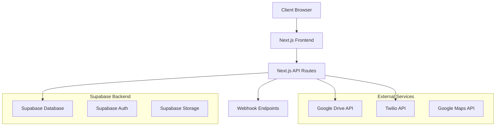

# Wedflow Design Document

## Overview

Wedflow is a modern wedding management SaaS platform built with Next.js 14, designed to be simple for non-technical users while maintaining scalability for multi-tenant deployment. The platform provides comprehensive wedding management tools including guest management, digital invitations, photo collection, vendor contacts, gift coordination, and event planning.

## Architecture

### High-Level Architecture



### Technology Stack

- **Frontend**: Next.js 14 (App Router), TailwindCSS, ShadCN UI
- **Backend**: Next.js API Routes
- **Database**: Supabase (PostgreSQL)
- **Authentication**: Supabase Auth
- **Content Management**: Sanity CMS
- **File Storage**: Google Drive (user-owned)
- **Deployment**: Vercel
- **External APIs**: Google Drive API, Google Maps API, Twilio API, Sanity CMS

### Multi-Tenant Architecture

Each couple gets an isolated workspace with:

- Unique subdomain or path: `wedflow.com/{couple-slug}`
- Row-level security in database
- Isolated data access patterns
- Private dashboard with public wedding site

## Components and Interfaces

### Core Components

#### 1. Authentication System

- **Login/Register**: Email/password and OTP-based authentication
- **Session Management**: Secure session handling with Supabase Auth
- **Multi-tenant Isolation**: Workspace-based data segregation

#### 2. Dashboard Layout

```typescript
interface DashboardLayout {
  sidebar: NavigationSidebar;
  header: DashboardHeader;
  content: DynamicContent;
  notifications: NotificationCenter;
}
```

#### 3. Guest Management Module

```typescript
interface GuestManager {
  guestList: GuestListView;
  addGuestForm: GuestEntryForm;
  bulkImport: BulkImportComponent;
  inviteGenerator: InvitationLinkGenerator;
}

interface Guest {
  id: string;
  name: string;
  phone: string;
  email?: string;
  group?: string;
  inviteStatus: "pending" | "sent" | "viewed";
  createdAt: Date;
  coupleId: string;
}
```

#### 4. Vendor Contacts Module

```typescript
interface VendorContactsManager {
  contactsList: ContactsListView;
  addContactForm: ContactEntryForm;
  categoryFilter: CategoryFilterComponent;
  searchBar: ContactSearchComponent;
}

interface VendorContact {
  id: string;
  name: string;
  phone: string;
  email?: string;
  category:
    | "decorator"
    | "event_coordinator"
    | "hall_manager"
    | "transport"
    | "photographer"
    | "caterer";
  notes?: string;
  createdAt: Date;
  coupleId: string;
}
```

#### 5. Event Pages Module

```typescript
interface EventPagesManager {
  eventEditor: EventDetailsEditor;
  venueManager: VenueDetailsComponent;
  timelineEditor: EventTimelineEditor;
  previewMode: PublicSitePreview;
}

interface EventDetails {
  id: string;
  coupleNames: string;
  coupleIntro: string;
  events: EventItem[];
  venues: VenueDetails[];
  timeline: TimelineItem[];
  coupleId: string;
}
```

#### 6. Photo Management System

```typescript
interface PhotoManager {
  driveIntegration: GoogleDriveConnector;
  uploadInterface: PhotoUploadComponent;
  galleryDisplay: PhotoGalleryComponent;
  highlightSelector: HighlightPhotoSelector;
}

interface PhotoCollection {
  id: string;
  driveFolder: string;
  categories: PhotoCategory[];
  highlightPhotos: string[];
  coupleId: string;
}
```

#### 7. Gift Portal

```typescript
interface GiftPortal {
  upiManager: UPIDetailsManager;
  qrUploader: QRCodeUploader;
  giftDisplay: PublicGiftInterface;
}

interface GiftSettings {
  id: string;
  upiId: string;
  qrCodeUrl?: string;
  customMessage: string;
  coupleId: string;
}
```

#### 8. Todo Planner

```typescript
interface TodoPlanner {
  taskList: TaskListComponent;
  taskEditor: TaskEditorComponent;
  categoryManager: CategoryManagerComponent;
  progressTracker: ProgressTrackerComponent;
}

interface TodoTask {
  id: string;
  title: string;
  description?: string;
  category: string;
  completed: boolean;
  dueDate?: Date;
  coupleId: string;
}
```

### Public Wedding Site Components

#### 1. Public Site Layout

```typescript
interface PublicWeddingSite {
  header: PublicHeader;
  heroSection: CoupleIntroSection;
  eventsSection: EventsDisplaySection;
  venueSection: VenueDetailsSection;
  gallerySection: PhotoGallerySection;
  giftsSection: GiftPortalSection;
  footer: PublicFooter;
}
```

## Data Models

### Database Schema

#### Users and Couples

```sql
-- Couples table (extends Supabase auth.users)
CREATE TABLE couples (
  id UUID PRIMARY KEY DEFAULT gen_random_uuid(),
  user_id UUID REFERENCES auth.users(id),
  couple_slug VARCHAR(50) UNIQUE NOT NULL,
  partner1_name VARCHAR(100) NOT NULL,
  partner2_name VARCHAR(100) NOT NULL,
  wedding_date DATE,
  created_at TIMESTAMP DEFAULT NOW(),
  updated_at TIMESTAMP DEFAULT NOW()
);
```

#### Guest Management

```sql
CREATE TABLE guests (
  id UUID PRIMARY KEY DEFAULT gen_random_uuid(),
  couple_id UUID REFERENCES couples(id) ON DELETE CASCADE,
  name VARCHAR(100) NOT NULL,
  phone VARCHAR(20) NOT NULL,
  email VARCHAR(100),
  group_name VARCHAR(50),
  invite_status VARCHAR(20) DEFAULT 'pending',
  invite_sent_at TIMESTAMP,
  invite_viewed_at TIMESTAMP,
  created_at TIMESTAMP DEFAULT NOW()
);
```

#### Vendor Contacts

```sql
CREATE TABLE vendor_contacts (
  id UUID PRIMARY KEY DEFAULT gen_random_uuid(),
  couple_id UUID REFERENCES couples(id) ON DELETE CASCADE,
  name VARCHAR(100) NOT NULL,
  phone VARCHAR(20) NOT NULL,
  email VARCHAR(100),
  category VARCHAR(30) NOT NULL,
  notes TEXT,
  created_at TIMESTAMP DEFAULT NOW()
);
```

#### Event Details

```sql
CREATE TABLE event_details (
  id UUID PRIMARY KEY DEFAULT gen_random_uuid(),
  couple_id UUID REFERENCES couples(id) ON DELETE CASCADE,
  couple_intro TEXT,
  events JSONB NOT NULL DEFAULT '[]',
  venues JSONB NOT NULL DEFAULT '[]',
  timeline JSONB NOT NULL DEFAULT '[]',
  updated_at TIMESTAMP DEFAULT NOW()
);
```

#### Photo Collections

```sql
CREATE TABLE photo_collections (
  id UUID PRIMARY KEY DEFAULT gen_random_uuid(),
  couple_id UUID REFERENCES couples(id) ON DELETE CASCADE,
  drive_folder_url TEXT NOT NULL,
  categories JSONB NOT NULL DEFAULT '[]',
  highlight_photos JSONB NOT NULL DEFAULT '[]',
  updated_at TIMESTAMP DEFAULT NOW()
);
```

#### Gift Settings

```sql
CREATE TABLE gift_settings (
  id UUID PRIMARY KEY DEFAULT gen_random_uuid(),
  couple_id UUID REFERENCES couples(id) ON DELETE CASCADE,
  upi_id VARCHAR(100),
  qr_code_url TEXT,
  custom_message TEXT,
  updated_at TIMESTAMP DEFAULT NOW()
);
```

#### Todo Tasks

```sql
CREATE TABLE todo_tasks (
  id UUID PRIMARY KEY DEFAULT gen_random_uuid(),
  couple_id UUID REFERENCES couples(id) ON DELETE CASCADE,
  title VARCHAR(200) NOT NULL,
  description TEXT,
  category VARCHAR(50) NOT NULL,
  completed BOOLEAN DEFAULT FALSE,
  due_date DATE,
  created_at TIMESTAMP DEFAULT NOW(),
  updated_at TIMESTAMP DEFAULT NOW()
);
```

### Row Level Security (RLS)

All tables implement RLS policies to ensure data isolation:

```sql
-- Example RLS policy for guests table
CREATE POLICY "Couples can only access their own guests" ON guests
  FOR ALL USING (couple_id IN (
    SELECT id FROM couples WHERE user_id = auth.uid()
  ));
```

## API Design

### REST API Endpoints

#### Authentication

- `POST /api/auth/login` - User login
- `POST /api/auth/register` - User registration
- `POST /api/auth/logout` - User logout

#### Guest Management

- `GET /api/guests` - List all guests for couple
- `POST /api/guests` - Create new guest
- `PUT /api/guests/[id]` - Update guest
- `DELETE /api/guests/[id]` - Delete guest
- `POST /api/guests/bulk-import` - Bulk import guests

#### Vendor Contacts

- `GET /api/contacts` - List all vendor contacts
- `POST /api/contacts` - Create new contact
- `PUT /api/contacts/[id]` - Update contact
- `DELETE /api/contacts/[id]` - Delete contact

#### Event Management

- `GET /api/events` - Get event details
- `PUT /api/events` - Update event details

#### Photo Management

- `GET /api/photos` - Get photo collection details
- `POST /api/photos/upload` - Handle photo uploads
- `PUT /api/photos/highlights` - Update highlight photos

#### Gift Portal

- `GET /api/gifts` - Get gift settings
- `PUT /api/gifts` - Update gift settings

#### Todo Management

- `GET /api/todos` - List all tasks
- `POST /api/todos` - Create new task
- `PUT /api/todos/[id]` - Update task
- `DELETE /api/todos/[id]` - Delete task

#### Public API

- `GET /api/public/[slug]` - Get public wedding site data

#### Webhooks

- `POST /api/webhooks/invite-sent` - Invitation sent notification
- `POST /api/webhooks/photo-uploaded` - Photo upload notification
- `POST /api/webhooks/guest-updated` - Guest update notification

## Sanity CMS Integration

### Content Management System

```typescript
interface SanityService {
  getWeddingTemplates(): Promise<WeddingTemplate[]>;
  getThemeSettings(): Promise<ThemeConfig>;
  getPreloadedTasks(): Promise<TodoTemplate[]>;
  getVendorCategories(): Promise<VendorCategory[]>;
}

interface WeddingTemplate {
  id: string;
  name: string;
  description: string;
  colorScheme: ColorScheme;
  layout: LayoutConfig;
  components: ComponentConfig[];
}

interface ThemeConfig {
  colors: ColorPalette;
  fonts: FontSettings;
  spacing: SpacingConfig;
  animations: AnimationSettings;
}
```

### Configurable Frontend Features

- **Wedding Site Themes**: Multiple pre-designed templates with customizable colors, fonts, and layouts
- **Component Library**: Reusable UI components that can be configured through Sanity Studio
- **Content Templates**: Pre-written content for different wedding traditions and cultures
- **Task Templates**: Preloaded wedding planning checklists that can be customized per region/culture
- **Vendor Categories**: Configurable vendor types and categories based on local wedding industry

### Sanity Schema Structure

```typescript
// Wedding Template Schema
const weddingTemplate = {
  name: "weddingTemplate",
  type: "document",
  fields: [
    { name: "name", type: "string" },
    { name: "description", type: "text" },
    { name: "colorScheme", type: "object" },
    { name: "layout", type: "object" },
    { name: "preview", type: "image" },
  ],
};

// Todo Template Schema
const todoTemplate = {
  name: "todoTemplate",
  type: "document",
  fields: [
    { name: "title", type: "string" },
    { name: "category", type: "string" },
    { name: "description", type: "text" },
    { name: "timeframe", type: "string" },
    { name: "priority", type: "string" },
  ],
};
```

## Twilio Integration

### SMS and WhatsApp Messaging

```typescript
interface TwilioService {
  sendSMS(to: string, message: string): Promise<string>;
  sendWhatsApp(to: string, message: string): Promise<string>;
  generateInviteMessage(guestName: string, weddingUrl: string): string;
}
```

### Invitation Sending Flow

1. Couple generates invitation links from dashboard
2. System creates personalized message with wedding URL
3. Twilio API sends SMS or WhatsApp message to guest
4. Delivery status is tracked and updated in database
5. Webhook notifications sent for delivery confirmations

## Google Drive Integration

### Drive API Implementation

```typescript
interface GoogleDriveService {
  uploadPhoto(file: File, folderId: string): Promise<string>;
  createFolder(name: string, parentId: string): Promise<string>;
  listPhotos(folderId: string): Promise<DriveFile[]>;
  getPublicUrl(fileId: string): Promise<string>;
}
```

### Photo Upload Flow

1. User selects photos on upload interface
2. Frontend validates file types and sizes
3. Files are uploaded to Google Drive via API
4. Drive file IDs are stored in database
5. Public URLs are generated for gallery display

## Error Handling

### Error Types

- **Authentication Errors**: Invalid credentials, expired sessions
- **Validation Errors**: Invalid input data, missing required fields
- **API Errors**: External service failures (Google Drive, Maps)
- **Database Errors**: Connection issues, constraint violations
- **File Upload Errors**: Invalid file types, size limits, Drive quota

### Error Response Format

```typescript
interface ErrorResponse {
  error: {
    code: string;
    message: string;
    details?: any;
  };
  timestamp: string;
}
```

## Testing Strategy

### Unit Testing

- Component testing with Jest and React Testing Library
- API route testing with supertest
- Database model testing with test database
- Utility function testing

### Integration Testing

- End-to-end user flows with Playwright
- API integration testing
- Google Drive integration testing
- Authentication flow testing

### Performance Testing

- Page load performance testing
- Database query optimization
- Image loading optimization
- Mobile responsiveness testing

### Security Testing

- Authentication security testing
- Data isolation testing (RLS)
- Input validation testing
- XSS and CSRF protection testing

## Deployment and Infrastructure

### Vercel Deployment

- Automatic deployments from Git
- Environment variable management
- Edge function optimization
- CDN for static assets

### Supabase Configuration

- Database migrations
- RLS policy setup
- Authentication configuration
- Real-time subscriptions setup

### Environment Variables

```env
NEXT_PUBLIC_SUPABASE_URL=
NEXT_PUBLIC_SUPABASE_ANON_KEY=
SUPABASE_SERVICE_ROLE_KEY=
GOOGLE_DRIVE_CLIENT_ID=
GOOGLE_DRIVE_CLIENT_SECRET=
GOOGLE_MAPS_API_KEY=
TWILIO_ACCOUNT_SID=
TWILIO_AUTH_TOKEN=
TWILIO_PHONE_NUMBER=
NEXT_PUBLIC_SANITY_PROJECT_ID=
NEXT_PUBLIC_SANITY_DATASET=
SANITY_API_TOKEN=
WEBHOOK_SECRET=
```

## Security Considerations

### Data Protection

- Row-level security for multi-tenant isolation
- Input validation and sanitization
- SQL injection prevention
- XSS protection with CSP headers

### Authentication Security

- Secure session management
- Password hashing with bcrypt
- OTP-based authentication option
- Rate limiting on auth endpoints

### API Security

- CORS configuration
- Request rate limiting
- Webhook signature verification
- Environment variable protection

## Performance Optimization

### Frontend Optimization

- Next.js App Router for optimal loading
- Image optimization with next/image
- Code splitting and lazy loading
- Caching strategies for static content

### Database Optimization

- Proper indexing on frequently queried columns
- Query optimization for large datasets
- Connection pooling
- Read replicas for scaling

### External API Optimization

- Caching Google Drive responses
- Batch API requests where possible
- Error retry mechanisms
- Rate limit handling
